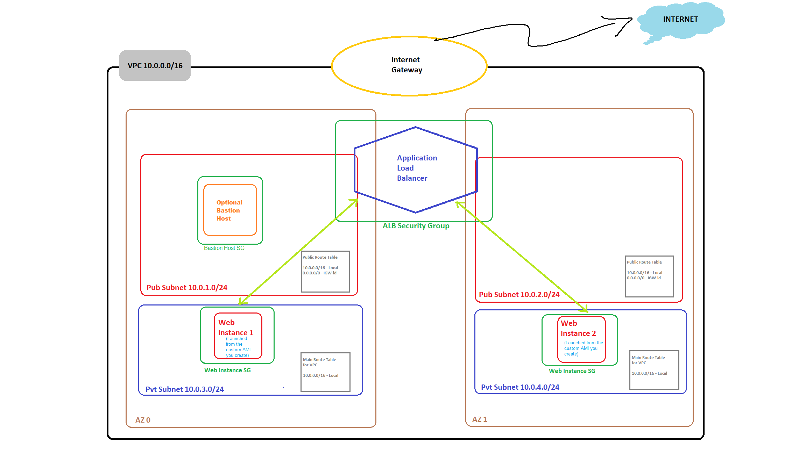

# Project 1: AWS Administration Midterm

## Overview

This project was completed for the AWS Administration class in Fall 2024. It consists of CloudFormation templates designed to automate the deployment of a simple web application. The deployment is divided into two stacks: one for the network infrastructure and another for the compute resources.

## Project Structure

- **Network Stack**: Deploys the necessary network infrastructure.
- **Compute Stack**: Manages the deployment of compute resources for the web application.

## Architecture Diagram

To understand the overall architecture of the deployment, please refer to the following diagram:

